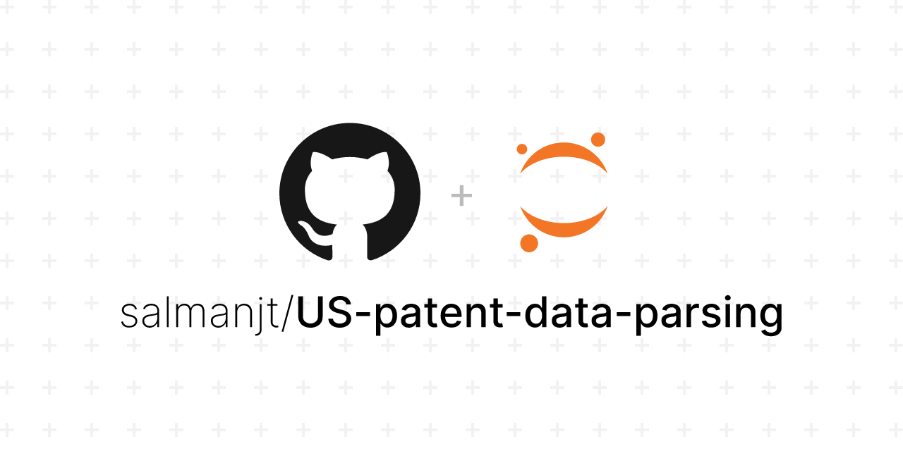

## Project Description

In this project, we parse and preprocess a raw text file containing information about grants given for Intellectual Property (IP) patent claims. By leveraging regular expressions and data manipulation techniques, this project aims to extract relevant data from the dataset and prepare it for downstream analysis.

## Project Tree

```
📦 US-patent-data-parsing
├─ LICENSE
├─ README.md
├─ data
│  ├─ input
│  │  └─ patent_grants_data.txt
│  ├─ output
│  │  ├─ patent_grants.csv
│  │  └─ patent_grants.json
│  └─ sample
│     ├─ sample_input.txt
│     ├─ sample_output.csv
│     └─ sample_output.json
├─ images
│  └─ US-patent-data-parsing.png
└─ notebooks
   └─ 01-data-parsing.ipynb
```

## Technologies Used

-   [Python](https://www.python.org/downloads/)
-   [Jupyter ](https://jupyter.org/)

## Why This Project Matters

Parsing and preprocessing raw data are fundamental steps in data analysis projects. By parsing the XML data and extracting relevant attributes such as grant ID, patent kind, patent title, number of claims, citations, inventors, claims text, and abstracts, the project facilitates the transformation of unstructured text data into a structured and organized format. This structured data is essential for downstream analysis, enabling insights to be gained from complex patent-related information.

## Further Improvements

-   **Automated Testing:** Implementing automated tests for the regular expressions and data extraction process could ensure stability and robustness of the project.
-   **Comparative Analysis:** Conducting a comparative analysis of different patent datasets to identify trends, patterns, or anomalies could contribute to a deeper understanding of IP patent grants.

## License

This project is licensed under the MIT License - see the [LICENSE](https://github.com/salmanjt/US-patent-data-parsing/blob/main/LICENSE) file for details.

## Credits

[Project Tree Generator](https://woochanleee.github.io/project-tree-generator)
