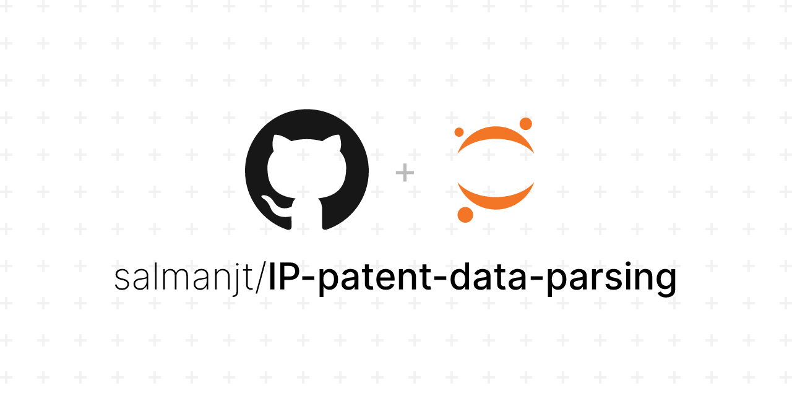

# IP Patent Data Parsing and Transformation



## Project Description

The primary objective of this project is to parse and preprocess a raw text file containing multiple XML documents of intellectual property (IP) patent grants. By leveraging regular expressions and data manipulation techniques, we extract relevant data from unstructured XML documents and transform it into a structured format suitable for data analysis, trend identification and machine learning applications related to patent data.

## Key Steps Involved

### Data Loading

Importing the raw text file that contains multiple XML documents, each representing a patent grant, and preparing it for data extraction.

### Data Parsing and Extraction

-   **Examining Patent Files:** Understanding the structure of the raw text file and identifying multiple XML documents within it, each corresponding to a patent grant.
-   **Regular Expressions Formulation:** Developing regular expressions to accurately extract key data fields such as grant IDs, patent kinds, titles, claims, citation counts, inventors and abstracts.
-   **Parsing Files:** Splitting the text file into individual XML documents and cleaning the data by removing newlines and replacing HTML entities.
-   **Data Extraction:** Applying the regular expressions to extract relevant information, handling anomalies and missing data where applicable.

### Data Transformation

-   **DataFrame Creation:** Organising the extracted data into a structured format using a pandas DataFrame for further analysis or manipulation.
-   **Outputting Files:** Saving the structured data into CSV and JSON formats for downstream applications or further processing.

### Data Validation

Ensuring the extracted data is correct and complete by validating the structured output (CSV and JSON files) against expected data structures and handling any inconsistencies.

Overall, this project demonstrates a practical and comprehensive approach to handling unstructured XML data. By parsing the XML data and extracting relevant attributes, the project facilitates the transformation of unstructured text data into a structured and organised format. This structured data is essential for downstream analysis, enabling insights to be gained from complex patent-related information. It lays a solid foundation for future analytical endeavours in patent data analysis and intellectual property research.

## Tools & Technologies

-   Python (Pandas, re)
-   Jupyter Notebook

## Project Tree

```
📦 IP-patent-data-parsing
├─ LICENSE
├─ README.md
├─ data
│  ├─ input
│  │  └─ patent_grants_data.txt
│  ├─ output
│  │  ├─ patent_grants.csv
│  │  └─ patent_grants.json
│  └─ sample
│     ├─ sample_input.txt
│     ├─ sample_output.csv
│     └─ sample_output.json
├─ images
│  └─ IP-patent-data-parsing.png
└─ notebooks
   ├─ 01-data-parsing.ipynb
   └─ exports
      └─ 01-data-parsing.py
```

## Installation

Clone the repository:

```bash
git clone https://github.com/salmanjt/IP-patent-data-parsing.git
cd IP-patent-data-parsing
```

## Data Sources

Raw text file containing multiple XML documents of patent grants was provided as part of the project specifications. The source of the data was not disclosed.

## Future Improvements

-   **Automated Testing:** Implement automated tests for the regular expressions and data extraction process to ensure stability and robustness of the project.
-   **Comparative Analysis:** Conduct comparative analyses of different patent datasets to identify trends, patterns or anomalies, contributing to a deeper understanding of IP patent grants.
-   **Scalability:** Optimise the code to handle larger datasets efficiently, possibly through parallel processing or memory management techniques.

## License

This project is licensed under the MIT License - see the [LICENSE](https://github.com/salmanjt/US-patent-data-parsing/blob/main/LICENSE) file for details.
